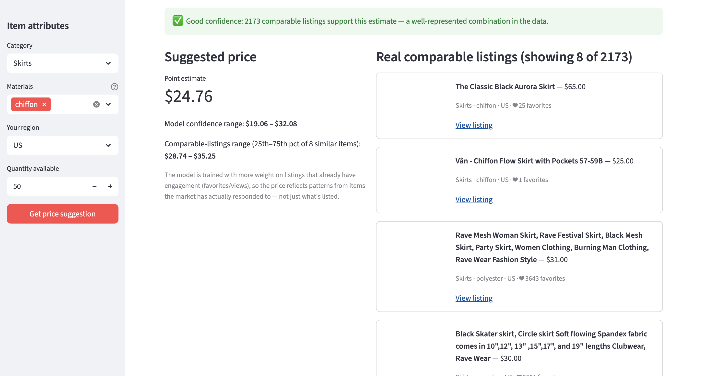

# Marketplace Price Intelligence

A price-estimation tool for independent and student designers selling handmade women's clothing. Enter an item's category, material, and region to see a typical marketplace price range — backed by real comparable listings and a transparent, feature-by-feature explanation of the estimate.

Built on ~4,500 real listings pulled live from the Etsy Open API v3, filtered to items the seller made themselves. Etsy hosts handmade goods, vintage resale, and mass-produced items side by side — the collector uses Etsy's own `who_made` field to keep only genuinely designer-made pieces, so resale and manufactured listings never enter the training data.



## What it does

- **Price range, not a single number.** The model gives an estimate plus a confidence range, framed as decision support rather than a claim about the one "correct" price.
- **Real comparable listings**, ranked by category, region, and material overlap, shown alongside the estimate.
- **A confidence indicator** that tells you honestly when a query is backed by very few comparable listings, rather than presenting every estimate with the same false certainty.
- **SHAP-based explainability** — a breakdown of exactly which attributes pushed the price up or down, and by how much, reconciling exactly to the final number.

## Results

Evaluated on a held-out 20% test split, currency-normalized to USD (21 currencies), scoped to designer-made (non-resale) women's clothing listings:

| Model | MAE | RMSE | Median AE | R² |
|---|---|---|---|---|
| Naive median baseline | $55.68 | $100.64 | $30.00 | −0.091 |
| Ridge regression | $50.45 | $92.42 | $25.19 | 0.080 |
| **Random Forest** | **$33.91** | **$71.96** | **$16.29** | **0.442** |
| XGBoost | $36.01 | $73.60 | $17.57 | 0.416 |

The pipeline evaluates all three real candidates and automatically deploys whichever wins on held-out R² — Random Forest, here, by a small but consistent margin over XGBoost. Both are retained as tree-based candidates specifically because SHAP's explainability method requires a tree-based model; Ridge stays in the table as a linear baseline for context.

Feature importance was cross-checked with permutation importance (which, unlike a tree ensemble's default importance metric, isn't biased toward numeric features with many split points). `quantity` came out as the strongest single predictor — a listing's quantity acts as a proxy for one-of-a-kind/custom work (quantity 1) versus repeatable batch production, a real and economically sensible pattern in a handmade marketplace, not a modeling artifact.

A modest R² here reflects a real, honest limitation rather than a bug: seller reputation, photo quality, and listing quality all meaningfully affect real marketplace prices, and none of them exist in this dataset. See `docs/` for the full technical writeups.

*(Table above is from an interim dataset — rerun `python src/train_model.py` on the final collected data and update these numbers before sharing.)*

## Architecture

```
Etsy Open API v3
       │
       ▼
Data collection  (src/etsy_collector.py)
  · taxonomy discovery, scoped to Women's Clothing
  · filtered to designer-made, non-supply listings
  · currency + region resolved per listing
       │
       ▼
Feature engineering  (src/features.py)
  · category / material / region encoding
  · demand-weighted training (favorites/views as sample weight)
       │
       ▼
Model training  (src/train_model.py)
  · baseline comparison: naive → Ridge → Random Forest → XGBoost
  · automatically deploys whichever tree model wins on held-out R²
  · per-category error breakdown, prediction interval coverage
       │
       ▼
Explainability  (src/explain.py)
  · SHAP-based, per-prediction breakdown
       │
       ▼
Streamlit app  (app.py)
  · price range + comparable listings + confidence + explanation
```

## Tech stack

Python · pandas · scikit-learn · XGBoost · SHAP · Streamlit · Etsy Open API v3

## Setup

```bash
pip install -r requirements.txt

# 1. Collect data (needs a free Etsy API key + shared secret from etsy.com/developers)
export ETSY_API_KEY="your_keystring"
export ETSY_SHARED_SECRET="your_shared_secret"
python src/etsy_collector.py --target 4500 --out data/raw/listings.csv --scope "Women's Clothing"

# 2. Train
python src/train_model.py

# 3. Run the app
streamlit run app.py
```

No Etsy key yet? `python src/generate_sample_data.py` produces a synthetic dataset with the same schema, so the full pipeline runs end to end without one.

## Project structure

```
designer-pricing-assistant/
├── app.py                       # Streamlit app
├── requirements.txt
├── src/
│   ├── etsy_collector.py        # Etsy API v3 data collection
│   ├── generate_sample_data.py  # synthetic fallback dataset
│   ├── features.py              # feature engineering
│   ├── train_model.py           # training, evaluation, baselines
│   └── explain.py               # SHAP explainability
├── data/
│   ├── raw/                     # collected Etsy listings
│   ├── sample/                  # synthetic sample dataset
│   └── processed/               # comparables table used by the app
├── models/
│   ├── price_model.joblib
│   └── metrics.json
└── docs/                        # technical deep-dives
```